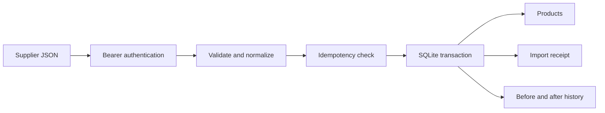

# Catalog Sync API

[](https://github.com/grantmaye/Catalog-Sync-API/actions/workflows/ci.yml)

**Turn supplier feeds into a consistent, auditable product catalog.**

A Node.js REST API that validates supplier JSON, normalizes product identifiers, stores prices as integer cents, and imports each batch atomically. Repeating an import does not create duplicate products or audit entries.

Independent personal portfolio project. All supplier names and products are synthetic; this repository contains no employer code or data.

## Run the demo

Requires **Node.js 24.x**. No dependency installation, API keys, or external services are needed for the demo.

```sh
npm test
npm run demo
```

The demo starts a temporary local HTTP server and in-memory database, imports three products, repeats the same request, changes one stock quantity, and retrieves paginated products and audit history. It stops the server afterward.

Expected results:

```text
First import:     201, inserted=3
Repeated import:  200, replayed=true
Updated feed:     201, updated=1, unchanged=2
Product history:  stock changed from 42 to 37
```

## Why this project

Supplier data frequently arrives with inconsistent identifiers, repeated submissions, and price or availability changes. The interesting engineering problem is keeping the catalog correct when requests fail or are retried.

This project demonstrates Node.js HTTP handling, ES modules, structured validation, authentication, SQL transactions, idempotency, request logging, and automated tests that exercise the real HTTP server.



## Run a persistent server

In a POSIX shell, run the following from this directory. Keeping the server in the background lets the example requests use the same environment variable.

```sh
export API_TOKEN="$(node -e 'process.stdout.write(require("node:crypto").randomBytes(32).toString("hex"))')"
npm start &
```

Wait for `Catalog API: http://127.0.0.1:3000`, then:

```sh
curl -s http://127.0.0.1:3000/health

curl -s http://127.0.0.1:3000/v1/imports \
  -H "Authorization: Bearer $API_TOKEN" \
  -H 'Content-Type: application/json' \
  -H 'Idempotency-Key: northstar-v1' \
  --data-binary @examples/northstar.json

curl -s 'http://127.0.0.1:3000/v1/products?limit=2' \
  -H "Authorization: Bearer $API_TOKEN"

curl -s http://127.0.0.1:3000/v1/products/2/history \
  -H "Authorization: Bearer $API_TOKEN"
```

The history example assumes a fresh database populated only with the sample feed. Otherwise use a product ID from the listing. Use `fg` and Ctrl+C to stop the background server. On Windows, run the server in one terminal and set the same token in a second terminal for requests.

| Variable | Default | Purpose |
| --- | --- | --- |
| `API_TOKEN` | Required | At least 24 characters; use a randomly generated value |
| `PORT` | `3000` | Local listening port |
| `DB_PATH` | `./data/catalog.sqlite` | SQLite database file |

## API

All routes except `/health` require `Authorization: Bearer …`.

| Method | Route | Behavior |
| --- | --- | --- |
| GET | `/health` | Process liveness |
| POST | `/v1/imports` | Import JSON with an `Idempotency-Key` header |
| GET | `/v1/imports/:id` | Retrieve the saved import receipt |
| GET | `/v1/products?limit=20&after=0&vendor=northstar` | Keyset pagination; optional vendor filter |
| GET | `/v1/products/:id/history` | Before/after changes in chronological insertion order |

`next_cursor` is the last product ID on a page when another page exists. Pass it as `after`, keeping the same vendor filter. Pagination is a live view, not a frozen snapshot.

### Feed contract

```json
{
  "vendor": "northstar",
  "products": [
    { "sku": "desk-100", "name": "Desk Phone", "price": "129.99", "stock": 42 }
  ]
}
```

- Vendor is a lowercase slug; SKU is normalized to uppercase. `(vendor, sku)` identifies a product.
- Price is a USD decimal **string** with exactly two fractional digits, from `0.00` to `9999999.99`. Floating point money is rejected.
- Stock is a nonnegative integer up to 10,000,000.
- A batch contains 1–1,000 products, with a 1 MiB HTTP body limit. Duplicate normalized SKUs reject the whole batch.
- Keys are global to this API instance. Same key + same normalized feed replays the receipt. Same key + changed feed returns `409`.
- Reordering products, changing vendor/SKU case, and surrounding whitespace do not change the normalized fingerprint. Unsupported extra fields are ignored.
- Unchanged products produce no new audit entry. Missing products are retained; the feed is an upsert batch, not a deletion instruction.

Errors use `{ "error": "…", "request_id": "…" }`. Typical statuses: `400` malformed request, `401` unauthenticated, `409` key conflict, `413` too large, `415` wrong content type, `422` invalid feed.

## Engineering decisions

- **Validate before writing.** A bad item cannot leave an import partially applied.
- **Persist receipts with product changes.** The receipt and audit entries commit together, so a retry can recover after a lost HTTP response.
- **Integer cents.** `0.29` is stored as `29`; prices never pass through floating point arithmetic.
- **Parameterized SQL.** Values are bound separately from SQL statements.
- **Bounded synchronous SQLite.** Simple and inspectable for a local demo. Large imports block the Node event loop; a larger system should move ingestion to workers and use a suitable shared database.
- **Small dependency surface.** Uses Node's HTTP, crypto, SQLite and test modules. `node:sqlite` may emit an experimental warning on some Node 24 releases.

## Tests

`npm test` covers normalized replay, conflicting keys, exact cents, change history, validation, persistence after reopening, cursor pagination, authentication, body limits, and rollback after a deliberately injected database failure. CI is configured in `.github/workflows/ci.yml`.

## Scope and next steps

The server binds to localhost. It has one API credential, no tenant isolation, rate limiter, retention job, XML adapter, live supplier connector, or production deployment configuration. Audit history is unpaginated and can grow over time. A real service needs these choices addressed before deployment.

See [EXERCISES.md](EXERCISES.md) for concrete extensions and interview walkthrough questions.

References: [Node SQLite](https://nodejs.org/docs/latest-v24.x/api/sqlite.html), [Node test runner](https://nodejs.org/docs/latest-v24.x/api/test.html), [GitHub Node CI](https://docs.github.com/en/actions/tutorials/build-and-test-code/nodejs).
